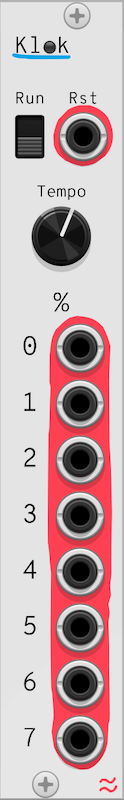

# Ondas
Ondas is a series of free, open-source modules for VCV rack. It includes BaBum (drum synth), Klok (modulo subdivision clock), Secu (probabilistic sequencer), Scener (scene manager), and Distroi (signal corruption effects).

By [Sergio Rodríguez Gómez](https://srsergiorodriguez.github.io/)

## Table of Contents

- [Ondas](#ondas)
  - [Table of Contents](#table-of-contents)
  - [Klok](#klok)
    - [Description](#description)
    - [Parameters](#parameters)
    - [Inputs](#inputs)
    - [Outputs](#outputs)
  - [Ktick](#ktick)
    - [Description](#description-1)
    - [Parameters](#parameters-1)
    - [Inputs](#inputs-1)
    - [Outputs](#outputs-1)
  - [BaBum](#babum)
    - [Description](#description-2)
    - [Parameters](#parameters-2)
    - [Inputs](#inputs-2)
    - [Outputs](#outputs-2)
  - [Bap](#bap)
    - [Description](#description-3)
    - [Parameters](#parameters-3)
    - [Inputs](#inputs-3)
    - [Outputs](#outputs-3)
  - [Secu](#secu)
    - [Description](#description-4)
    - [Parameters](#parameters-4)
    - [Inputs](#inputs-4)
    - [Outputs](#outputs-4)
  - [Scener](#scener)
    - [Description](#description-5)
    - [Parameters](#parameters-5)
    - [Inputs](#inputs-5)
    - [Outputs](#outputs-5)
  - [Scener Pro Max](#scener-pro-max)
    - [Description](#description-6)
    - [Parameters](#parameters-6)
    - [Inputs](#inputs-6)
    - [Outputs](#outputs-6)
  - [Distroi](#distroi)
    - [Description](#description-7)
    - [Parameters (Per Effect)](#parameters-per-effect)
    - [Inputs](#inputs-7)
    - [Outputs](#outputs-7)
  - [Logistic](#logistic)
    - [Description](#description-8)
    - [Parameters](#parameters-7)
    - [Inputs](#inputs-8)
    - [Outputs](#outputs-8)
  - [Bittorio](#bittorio)
    - [Description](#description-9)
    - [Parameters](#parameters-8)
    - [Inputs](#inputs-9)
    - [Outputs](#outputs-9)
  - [Hiller](#hiller)
    - [Description](#description-10)
    - [Parameters](#parameters-9)
    - [Inputs](#inputs-10)
    - [Outputs](#outputs-10)
  - [Norbert](#norbert)
    - [Description](#description-11)
    - [Parameters](#parameters-10)
    - [Inputs](#inputs-11)
    - [Outputs](#outputs-11)
  - [Suggestions for combining Modules](#suggestions-for-combining-modules)
  - [Attribution and License](#attribution-and-license)

## Klok
Clock generator with modulo outputs.

  

### Description
Klok generates a master clock signal with reset functionality and 8 modulo outputs for rhythmic divisions. Ideal for syncing sequencers, drum modules, or modulation sources. Drive sequencers like Secu or drum modules like BaBum. Create polyrhythms by combining multiple modulo outputs.

### Parameters
- Tempo: Adjust BPM (30–360).
- Run: Start/stop the clock.

### Inputs
- Reset Input: Resets the clock to step 0.

### Outputs
- Reset Output: Sends a pulse on reset.
- Modulo Outputs (0–7): Outputs triggers at divisions of the main clock (0 index based, e.g., Modulo 3 triggers every 4th beat).

## Ktick
Clock divider expander for Klok.

### Description
Ktick is a compact divider/expander that complements Klok. It provides four user-set division factors and exposes corresponding division outputs. When connected to Klok via the left expander header, Ktick receives the clock values from Klok and forwards them to its outputs; it also sends its configured division factors back to Klok. If no Klok is attached, outputs remain at 0V. Use Ktick when you want small dedicated division modules or when you want to surface division parameters at a different place in a patch. 

### Parameters
Division factor knobs (4 knobs, integer values 1–256, snap enabled) — choose the divisor for each output.

### Inputs
None — Ktick communicates with Klok over the expander header (no front-panel inputs required).

### Outputs
- Division outputs (4 outputs) — when connected to Klok these outputs emit the division CV/pulse values produced by Klok according to the configured factors. When not connected to Klok, they output 0V. 

## BaBum
Drum Synthesizer.

  

### Description
BaBum is a 5-part drum synthesizer featuring Kick (BD), Snare (SNR), Closed HiHat (HH), Open HiHat (HHO), and FX sounds. Each part includes customizable tuning, envelope shaping, distortion, and individual outputs. A mix output combines all signals with adjustable levels. Use sequencers (e.g., Secu) to trigger patterns.

### Parameters
- Tune (BD/SNR/FX): Adjust pitch of the drum.
- HiHat HP Filter (HH/HHO): Controls high-pass filter cutoff for noise-based HiHats.
- Length (BD/SNR/HH/HHO/FX): Sets decay time for each sound.
- Distortion (BD/SNR/FX): Adds harmonic saturation.
- Trigger (Buttons): Manually trigger each drum sound.
- Mix (Knobs): Adjust individual levels for the mix output.

### Inputs
- Trigger Inputs (BD/SNR/HH/HHO/FX): Gate/CV inputs to trigger sounds.
- Tune CV Inputs (BD/SNR/HH/FX): Modulate tuning parameters.

### Outputs
- Individual Outputs (BD/SNR/HH/HHO/FX): Direct outputs for each drum sound.
- Mix Output: Combined signal with level control.

## Bap
Expander module for BaBum drum synth.

### Description
Bap is a small expander/controller intended to pair with the BaBum drum synth. It exposes CV inputs for per-part length and distortion/parameter controls and forwards those values to a connected BaBum via the VCV expander messaging interface. When a matching BaBum is connected to the left expander header, Bap writes the current CV values into the shared message structure so the main BaBum module can use them. 

### Parameters
None — Bap is purely a CV / expander bridge (all control comes from inputs).

### Inputs
- Kick Length: CV to control kick decay/length.
- Snare Length: CV to control snare decay/length.
- HiHat Length: CV for hi-hat length.
- FX Length: CV for FX sound length.
- Kick Distortion: CV that maps to kick distortion.
- Snare Distortion: CV for snare distortion.
- FX Distortion: CV for FX distortion. 

### Outputs
None (values are sent to BaBum over the expander messaging). 

## Secu
Step sequencer with probability & randomization.

  

### Description
Secu is a 5-channel, 8-step sequencer with per-step gates, randomization, and probability-based step jumping. Pair with Klok for tempo-synced sequences. Control drum modules like BaBum or modulate effects in Distroi.

### Parameters
- Steps: Set sequence length (1–8 steps).
- Probability: Chance to skip steps or jump randomly.
- Randomize: Randomizes step gates with adjustable sparseness.
- Step Buttons: Toggle gates for each channel and step.

### Inputs
- Trigger: Advances the sequence.
- Reset: Resets to step 0.
- Randomize CV: Randomizes gates on trigger.
- Probability CV: Modulates step-skipping chance.

### Outputs
- Trigger Outputs (1–5): Gate signals for each channel.

## Scener
Scene-based channel mixer.

  

### Description
Scener manages 6 scenes x 5 input/output channels each, per-scene step counters, and controlled crossfaded transitions between scenes. Includes alerts for triggering events at specific steps. Build song structures by switching between scenes. Use alerts to synchronize effects (e.g., Distroi glitches) with scene changes.

### Parameters
- Scenes: Number of active scenes (1–6).
- Steps per Scene: Define duration for each scene.
- Transition / XFade Time: Adjust crossfade duration between scenes.
- Loop: Toggle looping of the scene sequence.
- Alerts: Per-scene percentage markers that trigger alert pulses.

### Inputs
- Trigger: Advances scenes.
- Reset: Returns to scene 0.
- Signal Inputs (30): 5 channels × 6 scenes.

### Outputs
- Signal Outputs (5): Crossfaded signals from active scenes.
- Alert Outputs (2): Triggers at user-defined step thresholds.

## Scener Pro Max
Large scene-based channel mixer.

### Description
Scener Pro Max is a lager version of Scener: 16 scenes × 6 input/output channels each, per-scene step counters, and alert outputs. Use it to assemble long song structures, crossfade mixes between scene snapshots, and trigger synchronized events at specific scene steps. It’s essentially a high-channel scene matrix with built-in step sequencer glue. 

### Parameters
- Scenes: Number of active scenes (1–16).
- Steps per Scene: Define duration for each scene.
- Transition / XFade Time: Adjust crossfade duration between scenes.
- Loop: Toggle looping of the scene sequence.
- Alerts: Per-scene percentage markers that trigger alert pulses.

### Inputs
- Trigger: Advances scenes.
- Reset: Returns to scene 0.
- Signal Inputs (30): 6 channels × 16 scenes.

### Outputs
- Signal Outputs (6): Crossfaded signals from active scenes.
- Alert Outputs (4): Triggers at user-defined step thresholds.

## Distroi
Multi-effect signal corruptor.

  

### Description
Distroi applies five destructive effects:

- Bitcrush: Reduces bit depth.
- Decimate: Downsamples the signal.
- Distort: Waveshaping saturation.
- Glitch: Buffer-based stutters.
- Crop: Abrupt signal silencing of signal fragments.

Degrade drums from BaBum for lofi textures. Glitch sequenced patterns from Secu. Process entire mixes from Scener for chaotic transitions.

### Parameters (Per Effect)
- Quantity: Effect intensity.
- CV Attenuation: Modulate "Quantity" via CV.
- Dry/Wet: Blend between original and processed signals.

### Inputs
- Inputs (5): Incoming signal. One per effect.
- CV Inputs (5): Modulate effect parameters.

### Outputs
Outputs (5): Processed signals.

## Logistic
Logistic map equation function generator.

### Description
Logistic implements a discretized logistic map (n_{t+1} = r · n_t · (1 − n_t)) with external clocking, CV modulation of the r parameter, reset and slew control. It can operate as a source of chaotic CV (when r is in the chaotic regime) or as a controllable, smoothly interpolated nonlinear function. The module includes a small visualisation of the bifurcation/plot points to help understand the current r value and behavior. Output is scaled to 0–5V. 

### Parameters
- r (1.1–3.9): Main map parameter controlling dynamics.
- r CV attenuator: Attenuate incoming r CV.
- Reset: Reset n to 0.5.
- Slew: Smoothing for the output transition.

### Inputs
- Tick: External trigger/clock to advance to next iteration.
- r CV: Modulate r parameter with CV.
- Slew CV: CV input to modulate slew/response.
- Reset: external reset to set n back to the nominal start. 

### Outputs
- Function output: current n value scaled to 0–5V, suitable for modulating pitch, gates (with comparators), filter cutoff, etc. 

## Bittorio
Cellular-automaton-based gate generator.

### Description
Bittorio is a compact cellular-automaton-based gate generator. It evolves a 16-cell (per row) CA across multiple epochs and exposes rows as gate outputs. You can select an elementary-CA rule (0–255), seed the initial row, randomize both rule and seed, and select which row/window of the precomputed history to output from. It’s useful for evolving rhythmic patterns that change step-to-step, with deterministic or randomized control.

### Parameters
- Rule: Select CA rule (0–255).
- Random rule: Button to pick a random rule (or use the input).
- Seed: Initial row/seed selector.
- Random seed: Button to choose a random seed.
- Window: Select which row / sector of the history to read.
- Reset: Reset step to zero.

### Inputs
- Next Step: Trigger/clock advances the readhead (step).
- Rule CV: 0–5V scales to rule index (overrides knob).
- Random Rule CV: Trigger to randomize rule.
- Seed CV: 0–5V scales to seed value (overrides knob).
- Random Seed CV: Trigger to randomize seed.
- Window CV: CV to choose window (0..3).
- Reset: External reset for the step counter. 

### Outputs
- Gate outputs (4 outputs: GATE_OUTPUT 0–3) — Each output emits 5V when the corresponding cell is on at the current step; otherwise 0V. Use the 4 outputs to derive poly-rhythms or feed to triggers/gates in your patch.

## Hiller
Input swapper based on comparator.

### Description
Hiller is a multi-set comparator/swapper. For each of its 4 sets it compares a reference signal against a threshold knob and, depending on the comparison, outputs either input A and B unmodified or swapped. This is a simple, sample-and-hold style switching utility that makes conditional routing and modal patching simple (e.g., route different CVs/audio to destinations based on an LFO or envelope crossing a threshold). 

### Parameters
- Comparator thresholds (4 knobs, one per set): Set the reference threshold for each comparator.

### Inputs
- A inputs (0–3): Signal A for each set.
- B inputs (0–3): Signal B for each set.
- Reference inputs (0–3): Comparator reference voltages (compared against the knob threshold).

### Outputs
- A outputs (0–3): Either A or B depending on comparator state.
- B outputs (0–3): The other signal (swapped when condition met).

## Norbert
Spring and damper feedback envelope.

### Description
Norbert simulates a one-dimensional spring-damper physical system (a simple mass-spring oscillator) and exposes the system angle/position as CV. It responds to trigger impulses (kicks) that change velocity, and its spring and damping coefficients are controllable by knobs and CV. The module produces smooth, physically inspired CV suitable for percussive modulation, resonant motion, or as a basis for FM/AM-style patches. Output is clamped to ±10V. 

### Parameters
- Spring: Base spring setting.
- Spring CV attenuator: Attenuates incoming spring CV.
- Damping: Base damping factor.
- Damping CV attenuator: Attenuates damping CV.
- Impulse Strength: How hard each trigger kick is.

### Inputs
- Trigger: When a trigger is received the module applies an impulse to velocity.
- Spring CV: Modulates the spring parameter.
- Damping CV: Modulates the damping parameter.

### Outputs
- Angle: The simulated angle/position as CV (clamped to ±10V), usable to drive oscillators, VCAs, filter cutoffs, or as expressive modulation.

## Suggestions for combining Modules
Clock-Driven Workflow:

Klok → Secu → BaBum → Scener → Distroi
Example: Klok clocks Secu to sequence BaBum drums. Scener crossfades between drum patterns, and Distroi adds glitches to the mix.

Live Performance:
Use Scener to switch between pre-configured scenes, with Distroi adding real-time effects triggered by Secu’s probability-based gates.

Experimental Sound Design:
Process BaBum’s FX output through Distroi’s bitcrush and glitch effects, modulated by Klok’s modulo outputs, Bittorio gates, or Norbert envelopes.

## Attribution and License

Copyright 2025 - Sergio Rodríguez Gómez

Source code: GPL-3.0-or-later License

Visual design: CC BY-NC-SA 4.0 License

